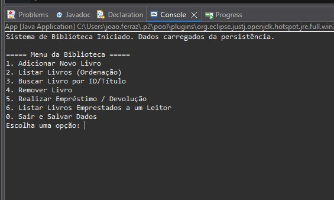
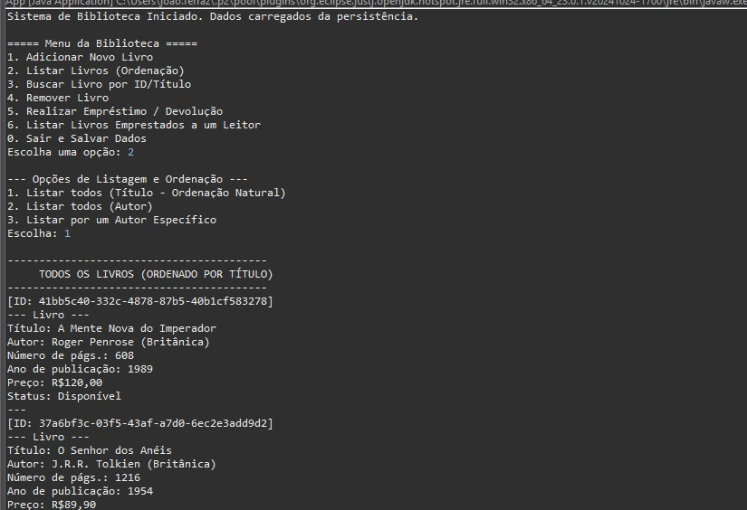
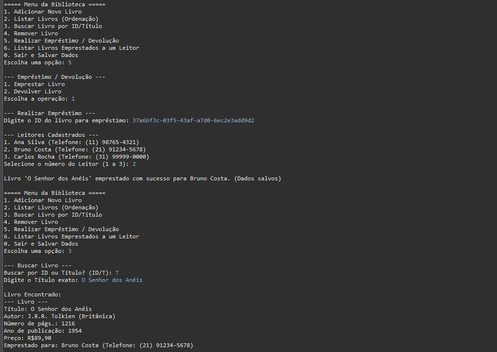
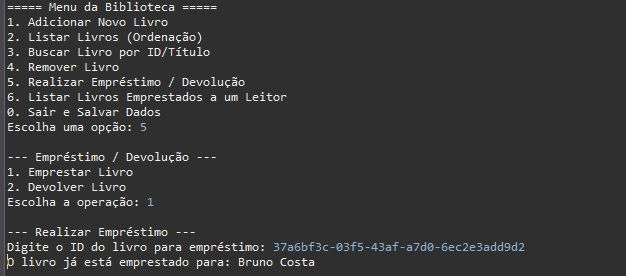
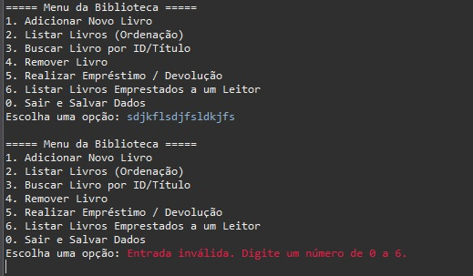

# 📖 Documentação Técnica – Sistema de Gerenciamento de Biblioteca

## 1. Introdução: O Projeto POO na Prática

Este projeto é um **Sistema de Gerenciamento de Biblioteca**, desenvolvido como um programa de **console em Java**. Meu foco principal foi aplicar na prática todos os conceitos que estudamos em **Programação Orientada a Objetos (POO)**.

O sistema foi desenhado para organizar uma coleção de livros. Ele realiza as funções básicas de adicionar, consultar, editar e remover itens (o famoso CRUD), além de controlar os empréstimos feitos pelos leitores.

**O que usamos na prática:**
* **Herança e Polimorfismo**
* **Encapsulamento**
* **Coleções Genéricas** (para garantir a segurança dos tipos)
* **Tratamento de Exceções** (para evitar que o programa quebre)
* **Persistência de Dados** (para salvar os dados em arquivo)

Escolhi a aplicação de console por ser simples e direta, permitindo que me concentrasse totalmente na lógica do negócio e na modelagem orientada a objetos.

---

## 2. O Que o Sistema Faz (Funcionalidades)

As principais funções que implementei no sistema são:

* **Salvar Dados (Persistência):** Os livros são salvos em um arquivo no computador usando o recurso de **serialização de objetos**. Assim, os dados não se perdem quando o programa é fechado e podem ser carregados novamente na próxima execução.
* **Gerenciamento de Livros (CRUD):** É fácil adicionar, remover ou editar livros. A busca pode ser feita pelo ID único ou pelo título do livro.
* **Controle de Empréstimos:** O sistema registra quem pegou qual livro e controla as devoluções, associando cada livro emprestado a um leitor específico.
* **Organização e Listagem:** Podemos listar os livros de várias maneiras, como ordenados por título ou autor. Também implementei filtros, como listar todos os livros de um autor específico ou apenas aqueles que estão emprestados.
* **Prevenção de Erros:** Usei o **tratamento de exceções** (o `try-catch`) para evitar falhas, tanto para lidar com entradas de usuário que não fazem sentido (como digitar texto onde se espera um número) quanto para problemas de leitura e escrita de arquivos.

---

## 2.1 Demonstração Visual da Interface

Para ilustrar as funcionalidades no console, seguem as capturas de tela:

### A. Menu Principal e Inicialização
Mostra o menu principal do sistema carregando os dados de persistência.

### B. Listagem e Ordenação
Exemplo de escolha de listagem e exibição dos livros ordenados por título.

### C. Empréstimo, Busca e Status
Demonstra o processo de empréstimo de um livro a um leitor cadastrado e, em seguida, o resultado da busca, mostrando o livro como "Emprestado" para um leitor específico.

### D. Tratamento de Erro (Livro Já Emprestado)
Mostra como o sistema valida a lógica de negócio, impedindo que um livro já emprestado seja emprestado novamente e informando para qual leitor ele está.

### E. Tratamento de Erro (Entrada Inválida)
Exemplo do mecanismo de tratamento de exceções em ação, avisando o usuário quando ele digita uma opção inválida no menu.

---

## 3. Como o Código Está Organizado (Arquitetura)

O código foi dividido em **três camadas** principais para separar as responsabilidades, o que facilita a manutenção e a expansão futura:

| Camada | Pacote | O que Faz |
| :--- | :--- | :--- |
| **Modelo** | `model` | Contém as classes que representam as "coisas" da biblioteca (Livro, Leitor, Autor, Pessoa). |
| **Serviço** | `service` | É o "cérebro" do sistema. Contém a **Lógica de Negócio** e a parte de persistência de dados. |
| **Aplicação** | `main` | A interface de **Apresentação**. É a classe principal que interage com o usuário pelo console. |

---

## 4. Detalhando as Classes

### 4.1 Pacote `model` (As Entidades)

| Classe | Descrição |
| :--- | :--- |
| `Pessoa` | A classe-mãe (abstrata) que guarda dados comuns, como nome, telefone e e-mail. |
| `Leitor` | Representa o usuário. Ela **herda** os dados básicos da classe `Pessoa`. |
| `Autor` | Guarda informações sobre o autor (nome, nacionalidade). |
| `Livro` | A classe mais importante. Representa o livro e implementa a interface `Comparable` para permitir a ordenação. |

**Como as Classes se Relacionam:**
* **Livro e Autor:** Há uma **Composição** – o Livro *precisa* ter um Autor.
* **Livro e Leitor:** Há uma **Associação Opcional** – o Livro *pode* ter um Leitor associado (se estiver emprestado).

---

### 4.2 Pacote `service` (A Lógica)

| Classe | Descrição |
| :--- | :--- |
| `Persistencia` | É a classe que lida diretamente com os arquivos, usando serialização para salvar e carregar os dados. |
| `GerenciadorBiblioteca` | A classe central! Nela estão todas as regras de negócio e o controle da lista principal de livros (`ArrayList<Livro>`). |

O `GerenciadorBiblioteca` usa a `Persistencia` sempre que é necessário salvar ou carregar as alterações nos dados.

---

## 5. Como Usei POO de Verdade

Usei os principais conceitos de Programação Orientada a Objetos da seguinte maneira:

| Conceito | Onde Aplicamos |
| :--- | :--- |
| **Herança** | A classe `Leitor` estende e aproveita os atributos e métodos da classe `Pessoa`. |
| **Encapsulamento** | Todos os atributos importantes das classes são `private`, e o acesso é feito apenas por meio de métodos públicos (`getters` e `setters`). |
| **Polimorfismo** | Sobrescrevi (usei `@Override`) métodos como `toString()` e `equals()` nas classes de modelo para que se comportem de forma específica para cada objeto. |
| **Coleções Genéricas** | Usei `ArrayList<Livro>` e `ArrayList<Leitor>` para garantir que a lista só aceite o tipo de objeto correto (segurança de tipos). |
| **Interfaces** | Implementei `Comparable<Livro>` para definir a ordem natural dos livros (pelo título) e usei `Comparator`s para ordenações flexíveis por outros critérios. |
| **Tratamento de Exceções** | Usei `try-catch` em vários pontos para garantir que o sistema lide com erros de I/O de arquivos e entradas do usuário. |

---

## 6. Como os Dados São Salvos (Serialização)

Para não perder os dados, usei a **serialização de objetos**.

### O Fluxo:

* **Ao Ligar o Sistema:** O `GerenciadorBiblioteca` tenta carregar a lista de livros que foi salva no arquivo. Se o arquivo ainda não existir (primeiro uso) ou estiver com problemas, ele simplesmente cria uma nova lista vazia.
* **Durante o Uso:** Toda vez que um livro é cadastrado, editado, removido ou emprestado, os dados são **imediatamente salvos** no arquivo. Assim, garantimos que o estado mais recente dos dados está sempre persistido.

---

## 7. Conclusão e Próximos Passos

O desenvolvimento deste projeto foi uma ótima oportunidade para colocar em prática os conceitos de POO. Consegui criar um sistema funcional que atende aos requisitos propostos.

Para uma **demonstração prática** e visual do uso do sistema, confira o vídeo no link abaixo.

**Link para Demonstração (Vídeo):** [Assistir à Demonstração do Sistema de Biblioteca no YouTube](https://youtu.be/Vad1gY-tCD4)

> **Observação:** O vídeo demonstra as funcionalidades de CRUD, empréstimo/devolução e o tratamento de erros apresentado nas capturas de tela.

Embora seja um projeto de console simples, ele é bem estruturado. Se for necessário expandir, a implementação de uma interface gráfica ou migração da persistência para um banco de dados relacional sem ter que reescrever toda a lógica de negócio podem ser levadas para a próxima etapa de implementação do projeto.
